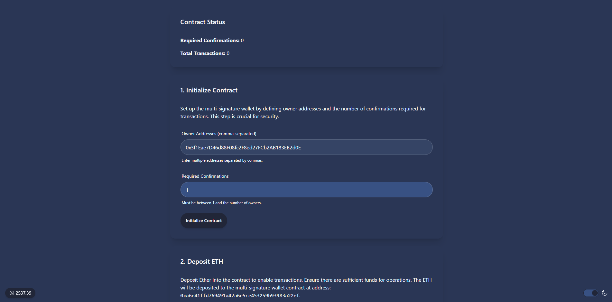
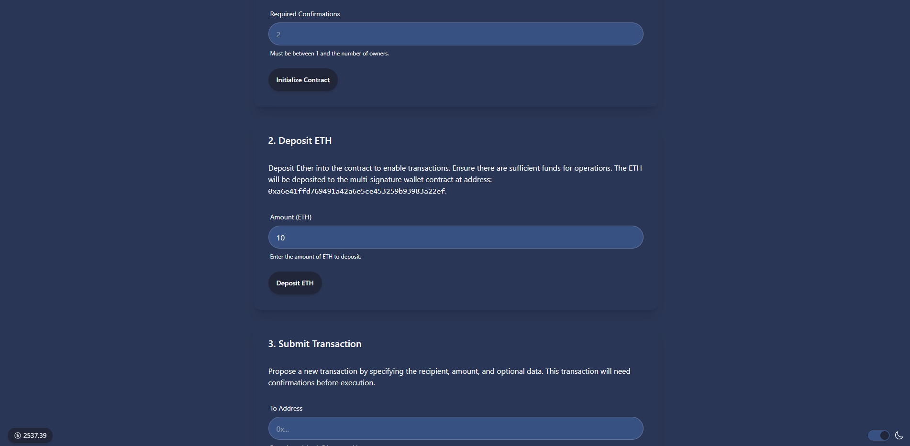
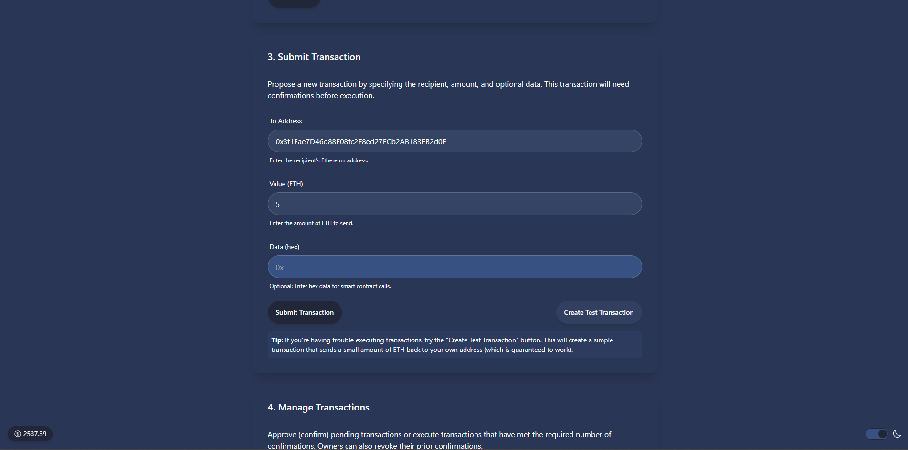
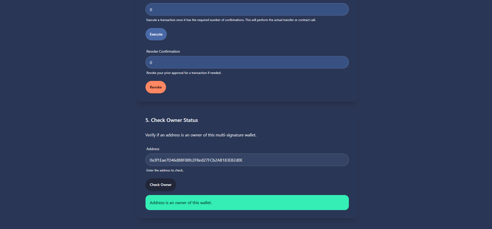

# 🚩 Challenge #3: 🎟 Multisig Wallet

> ⚠️ **Important:** Please complete **Challenge #2** first if you haven't already, as it contains essential instructions related to all upcoming challenges.

🎛️ **Multisig Wallet on Stylus** 💼

🚀 **Overview**

Welcome to the Multi-Signature (Multisig) Wallet challenge! This project demonstrates a secure way to manage funds on the blockchain using a Rust-based smart contract built with the Stylus SDK. A multisig wallet requires multiple parties to approve transactions, enhancing security by distributing control among several owners.

✨ **Key Features**

- 🔒 **Multi-Signature Security**: Transactions require approval from a predefined number of wallet owners, preventing unauthorized access.
- 📝 **Transaction Management**: Owners can submit, confirm, revoke, and execute transactions with full transparency.
- 👥 **Owner Roles**: Assign multiple owners with unique permissions to collaboratively manage the wallet.
- 📊 **Activity Logs**: Emit detailed events for every wallet operation, ensuring auditability and traceability.

🌟 **Project Goals**

1️⃣ **Smart Contract**: Develop a robust multi-signature wallet for secure fund and transaction management.
2️⃣ **Frontend App**: Build an intuitive interface for interacting with the wallet, making it easy to manage transactions.
3️⃣ **Deploy**: Launch the contract on a Local Nitro Dev Node for testing and development.

🎉 Let's redefine secure fund management with multisig wallets! 🚀

## 💡 **What is a Multi-Signature Wallet?**

A multi-signature wallet is a blockchain-based account that requires multiple private keys to authorize transactions. Unlike a single-signature wallet, where one person has full control, a multisig wallet distributes authority among several owners. For example, in a 2-of-3 multisig wallet, at least 2 out of 3 owners must approve a transaction before it can be executed. This setup is ideal for:

- **Enhanced Security**: Protects against theft or loss of a single key by requiring consensus.
- **Shared Control**: Perfect for teams, organizations, or families managing shared funds.
- **Transparency**: All actions are logged on the blockchain, providing an immutable record.

In this project, you'll interact with a multisig wallet smart contract written in Rust, deployed on a local Nitro node, and accessible via a user-friendly Next.js frontend.

## Checkpoint 0: 📦 Environment Setup 📚

Before you begin, ensure you have the following tools installed:

- [Node (>= v18.17)](https://nodejs.org/en/download/)
- Yarn ([v1](https://classic.yarnpkg.com/en/docs/install/) or [v2+](https://yarnpkg.com/getting-started/install))
- [Git](https://git-scm.com/downloads)
- [Docker](https://www.docker.com/get-started) (for running the Nitro dev node)

Then, download the challenge to your computer and install dependencies by running:

> ⚠️ **IMPORTANT**: Run the commands below in WSL (Windows Subsystem for Linux) only. PowerShell may cause errors due to unsupported file formats.

```sh
git clone -b multi-sig https://github.com/abhi152003/speedrun_stylus.git
cd speedrun_stylus
yarn install
```

> In the same terminal, after all dependencies are installed, run the commands below to start the local dev node in Docker. This script will deploy the contract and generate the ABI for interaction:

```sh
cd speedrun_stylus # if not done
cd packages
cd cargo-stylus
cd multi-sig
```

> Now open your Docker desktop and then return to your IDE and run the command below to spin up the nitro devnode in Docker. This will deploy the contract and generate the ABI so you can interact with the contracts written in RUST:

```bash
bash run-dev-node.sh
```

This command will spin up the nitro devnode in Docker. You can check it out in your Docker desktop. This will take some time to deploy the RUST contract, and then the script will automatically generate the ABI. You can view all these transactions in your terminal and Docker desktop. The Docker node is running at localhost:8547, but before running this command make sure about the below thing

## 🚨 Fixing Line Endings and Running Shell Scripts in WSL on a CRLF-Based Windows System

> ⚠️ This guide resolves the "Command not found" error caused by CRLF line endings in shell scripts when running in a WSL environment.

---

## 🛠️ Steps to Fix the Issue

### Convert Line Endings to LF
Shell scripts created in Windows often have `CRLF` line endings, which cause issues in Unix-like environments such as WSL. To fix this:

#### Using `dos2unix`
1. Install `dos2unix` (if not already installed):
   ```bash
   sudo apt install dos2unix
   ```

2. Convert the script's line endings:
    ```bash
   dos2unix run-dev-node.sh
   ```

3. Make the Script Executable:
    ```bash
    chmod +x run-dev-node.sh
    ```

4. Run the Script in WSL:
    ```bash
    bash run-dev-node.sh
    ```

> In the same WSL terminal window or at the Docker Desktop terminal, view the details of your contract deployment, including the deployment transaction hash for later verification.


> Then, in a second WSL terminal window, start your 📱 frontend:

```sh
cd speedrun_stylus # if not done
cd packages # if not done
cd nextjs
yarn run dev OR yarn dev
```

📱 Open [http://localhost:3000](http://localhost:3000) to see the app.

---

## 💫 Checkpoint 1: Frontend Magic

After completing Checkpoint 0, interact with your contract via the frontend. Click on "Debug Contracts" from the Navbar or the Debug Contracts section on the screen.

### 🛠️ **Frontend Features and User Flow**

The interface guides you through the multisig wallet process with the following steps:

#### **Step 1: Initialize the Contract**
- **Set Owners**: Provide a comma-separated list of owner addresses (e.g., `0x123..., 0x456...`).
- **Define Confirmation Requirements**: Specify the number of confirmations needed for a transaction to execute (must be between 1 and the number of owners).


**Why?** This establishes the security framework by defining who controls the wallet and how many approvals are needed, preventing single-point failures.

#### **Step 2: Deposit ETH**
- **Deposit Funds**: Send ETH to the contract to fund transactions.

**Why?** Funds are necessary for the wallet to operate. This step ensures the contract has the necessary balance for outgoing transactions.

#### **Step 3: Submit a Transaction**
- **Enter Details**: Specify the recipient address, ETH amount, and optional hex data for smart contract interactions.
- **Submit**: Add the transaction to the pending list for owner approval.

**Why?** This initiates the transaction process, allowing owners to review and approve before execution.

Note : You'll be able to see your transaction index at the top of the page which you can use to perform the next steps.


#### **Step 4: Confirm a Transaction**
- **Approve**: Owners confirm transactions using the transaction index.

**Why?** Confirmations ensure consensus among owners, a core security feature of multisig wallets.

#### **Step 5: Execute a Transaction**
- **Check Status**: Verify if the required confirmations are met.
- **Execute**: Transfer funds to the recipient once approved.

**Why?** Execution finalizes the transaction, securely transferring funds only after consensus.

#### **Step 6: Revoke Confirmation (Optional)**
- **Revoke**: Owners can withdraw their confirmation if they change their mind before execution.

**Why?** Adds flexibility, allowing owners to adapt to new information or concerns.

#### **Step 7: Check Contract Details**
- **Owner Status**: Verify if an address is an owner.
- **Contract Stats**: View total transactions and required confirmations.

**Why?** Provides transparency and easy access to critical wallet information.

#### **Step 8: Track Transactions**
- **Blockchain Explorer**: Links to transaction details for on-chain verification.

**Why?** Enhances trust by allowing users to independently verify wallet activity on the blockchain.

💼 Take a quick look at your deploy script `run-dev-node.sh` in `speedrun_stylus/packages/cargo-stylus/multi-sig/run-dev-node.sh`.

📝 To edit the frontend, navigate to `speedrun_stylus/packages/nextjs/app` and open the specific page you want to modify, such as `/debug/page.tsx`. For guidance on [routing](https://nextjs.org/docs/app/building-your-application/routing/defining-routes) and configuring [pages/layouts](https://nextjs.org/docs/app/building-your-application/routing/pages-and-layouts), check the Next.js documentation.

---

## Checkpoint 2: 💾 Deploy Your Contract! 🛰

🛰 You don't need to provide specifications to deploy your contract because it is automatically deployed via `run-dev-node.sh`.

> Check the deployment process below:


The above command deploys the contract functions defined in `speedrun_stylus/packages/cargo-stylus/multi-sig/src/lib.rs`.

> This local account deploys your contracts using a pre-funded account's private key, so you don't need to enter a personal key.

## Checkpoint 3: 🚢 Ship Your Frontend! 🚁

> Contracts are deployed at the `localhost:8547` endpoint where the Nitro dev node runs in Docker. Verify the network in the frontend at [http://localhost:3000](http://localhost:3000):


🚀 **Deploy Your NextJS App**

```shell
vercel
```

> Follow the steps to deploy to Vercel. Once logged in (via email, GitHub, etc.), the default options should work. You'll receive a public URL.

> To redeploy to the same production URL, run `yarn vercel --prod`. Omitting the `--prod` flag deploys to a preview/test URL.

---

## Checkpoint 4: 📜 Contract Verification

Verify your smart contract by running:

```bash
cargo stylus verify -e http://127.0.0.1:8547 --deployment-tx "$deployment_tx"
# Deployment_tx can be obtained from the Docker Desktop terminal after contract deployment.
```

> It's okay if it says your contract is already verified.

If you want to redeploy after verification, use:

```bash
cargo stylus deploy -e http://127.0.0.1:8547 --private-key "$your_private_key"
# You can use the pre-funded account's private key as well.
```

---

## 🏁 Next Steps

Explore more challenges or contribute to this project!

> 🏃 Head to your next challenge [here](https://speedrunstylus.com/challenge/uniswap-v2-stylus).
